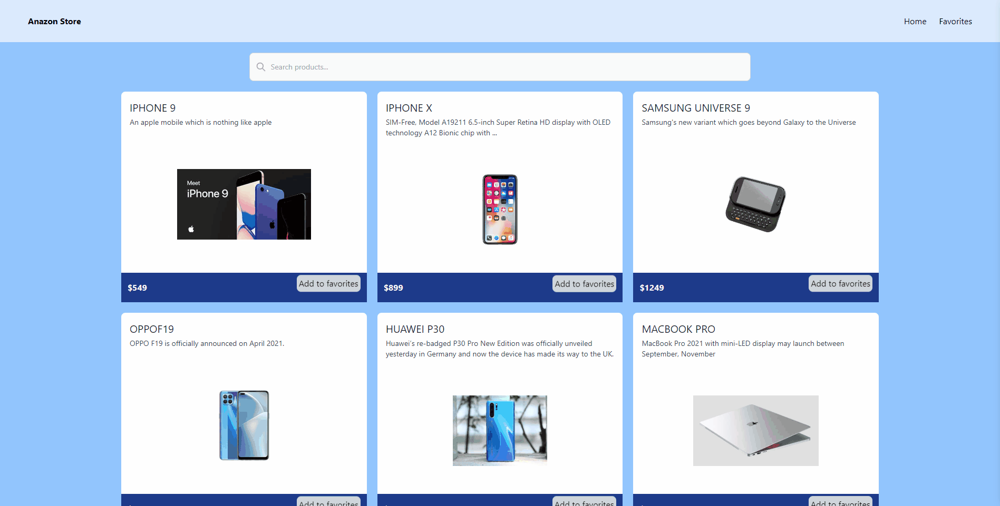

## https://anazon-store-app.vercel.app
# Anazon Store App
## Description

Project aims to create a simple Store App.


## Project Skeleton

```
SOLUTION
├── src
│    ├── index.css
│    ├── index.tsx
│    ├── App.tsx
│    ├── app
│    │   ├── hooks.ts
│    │   └── store.ts
│    ├── components
│    │   ├── Card.tsx
│    │   ├── Navbar.tsx
│    │   └── SearchComp.tsx
│    ├── features
│    │   └── productsSlice.ts
│    ├── models
│    │   └── models.ts
│    ├── pages
│    │   ├── FavoritesPage.tsx
│    │   └── Home.tsx
│    └── react-app-env.d.ts
├── package.json
├── README.md
├── tailwind.config.js
├── tsconfig.json
└── yarn.lock
```

## Expected Outcome



## Steps

- Step 1 : Create React App using `npx create-react-app ts-store --template` or `yarn create react-app ts-store --template`.(With this command, both tailwindcss and typescript are ready to go.)

- Step 2 : Use dummyJson API for products..

- Step 3 : You can view sample app on https://anazon-store-app.vercel.app/?vercelToolbarCode=4AGB-xroBA1rU5X.

